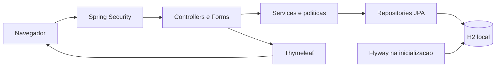

# Estrutura computacional

Revisão de 16/09/2026. Fontes: [pom.xml](../../pom.xml), [configuração](../../src/main/resources/application.properties) e [código](../../src/main/java/com/portfolio/rastreabilidade/).

## Arquitetura atual

Monólito organizado por domínio. Controllers recebem HTTP, forms validam entradas, services coordenam regras/transações, entidades validam invariantes e repositories acessam o banco. Não há gateway, broker ou microsserviços implementados.

| Componente | Situação |
|---|---|
| Linguagem/runtime | Java 25, definido no Maven |
| Aplicação | Spring Boot 4.1.1 e Spring MVC com servidor embutido |
| Interface | Thymeleaf, HTML e CSS local |
| Validação | Jakarta Validation e invariantes de entidades/services |
| Persistência | Spring Data JPA; Hibernate valida o esquema; Open Session in View desabilitado |
| Migrações | Flyway V1 a V11 |
| Segurança | Spring Security, sessão, login por formulário e senha codificada |
| Observabilidade inicial | Actuator: exposição configurada de health/info, sem detalhes públicos de saúde |
| Testes | Maven Wrapper, JUnit, Mockito, MockMvc e H2 em memória |

Driver PostgreSQL e integração Flyway correspondente estão presentes. A configuração e os testes atuais usam H2; compatibilidade produtiva com PostgreSQL ainda precisa ser demonstrada.

## Pacotes

| Pacote | Responsabilidade |
|---|---|
| `produto`, `lote` | Cadastros e invariantes |
| `recebimento`, `expedicao` | Documentos, itens e confirmação |
| `estoque` | Ledger e saldo agregado |
| `rastreabilidade` | Histórico e preparação de dados para tela |
| `usuario`, `acesso` | Identidades, perfis, permissões e política administrativa |
| `config`, `web` | Configuração transversal, login e painel |

## Ambientes

| Ambiente | Estado | Execução |
|---|---|---|
| Desenvolvimento | Configurado | H2 em `data/`, aplicação local na porta padrão 8080 |
| Testes | Configurado | H2 em memória, perfil `test`, relatórios em `target/surefire-reports/` |
| Homologação | Proposto | Configuração externa, banco de destino e dados sintéticos |
| Produção | Pendente | Topologia, capacidade, segredos, TLS, operação e recuperação a definir |

Não existe dimensionamento medido de CPU, memória ou disco. Levantar volume diário, tamanho por registro, retenção, concorrência e latência antes de fixar capacidade. A exclusão de `data/` do Git não constitui backup.

## Transações e recursos

Documento e movimentações são gravados na mesma transação. Expedição usa `READ_COMMITTED`, trava documento e produtos em ordem de ID, agrega demanda por produto/lote e compara o saldo. Restrições únicas por item complementam a prevenção de duplicidade. Falha na gravação deve reverter a confirmação inteira.

O saldo é calculado pelo ledger, sem reserva ou cache de saldo implementados. Agregações poderão exigir otimização com crescimento; qualquer materialização deve manter conciliação com a origem.

## Implantação proposta

Empacotar com `mvnw.cmd package`, externalizar configuração e separar credenciais por ambiente. Ensaiar migração e restauração antes de implantação. Reverter aplicação não desfaz automaticamente esquema/dados: cada mudança precisa de plano de compatibilidade e recuperação. Métricas de latência, erro, CPU, heap, disco e conexões ainda precisam ser coletadas.
