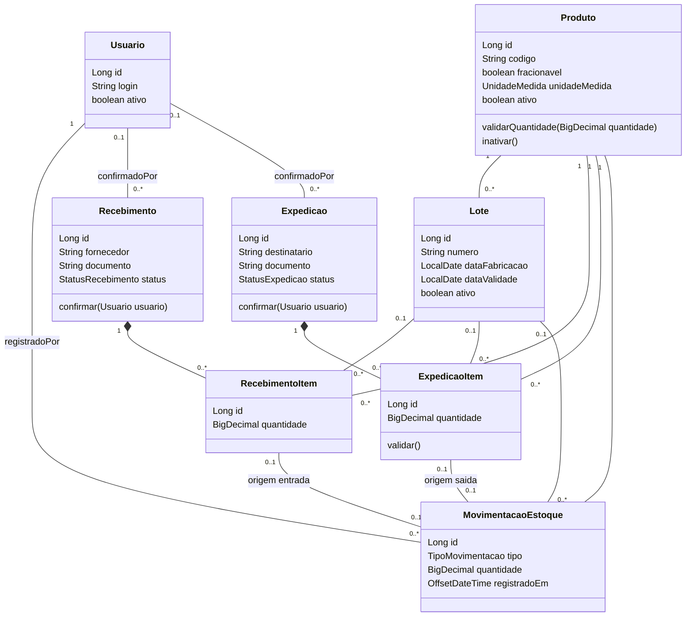
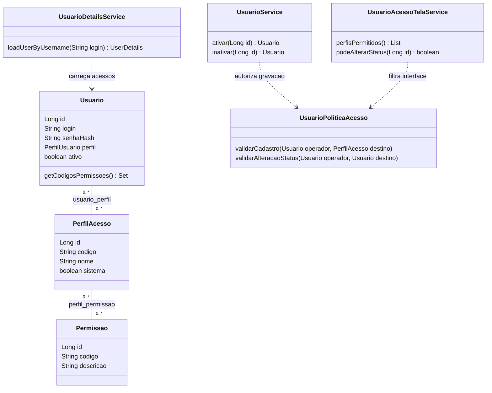
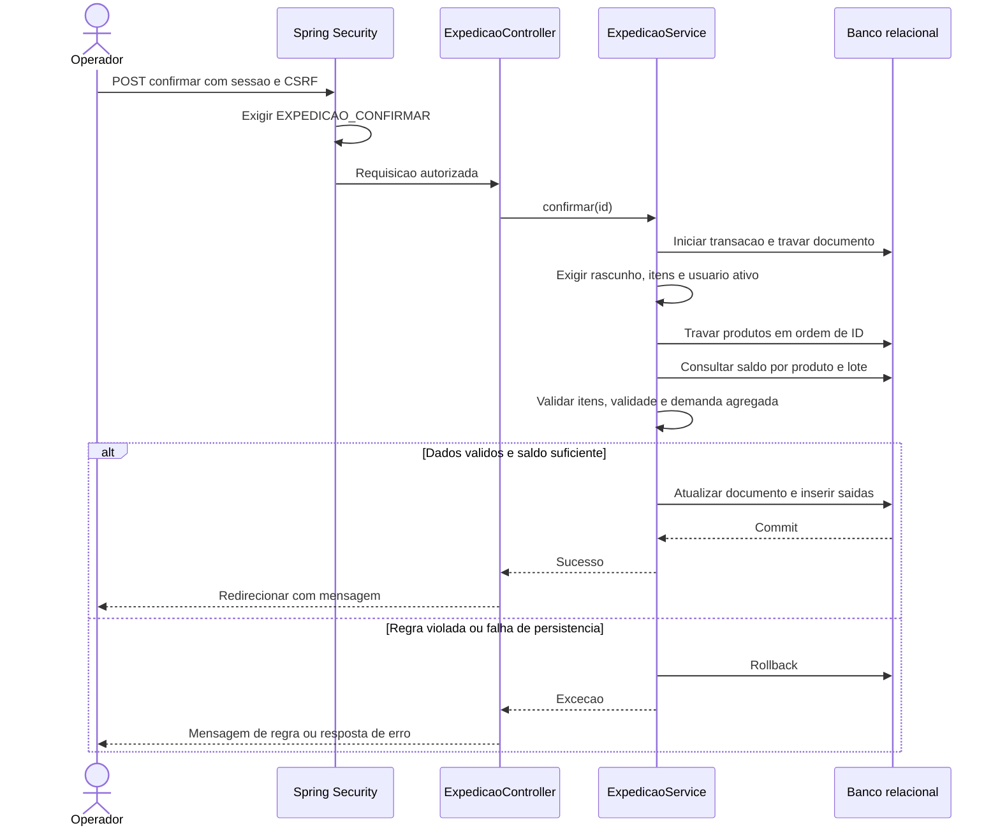
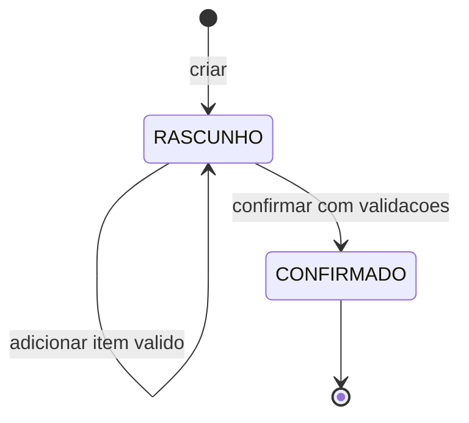

# UML — domínio e comportamento

Modelos simplificados de `5153f62`, revisão 16/09/2026. Diagramas Mermaid de classes, sequência e estados representam visões UML. Nem todos os campos/getters são exibidos. Fontes: [código](../../src/main/java/com/portfolio/rastreabilidade/) e migrações V2–V11.

## Classes operacionais

Cada movimentação tem **exatamente uma origem**, recebimento_item ou expedicao_item, conforme seu tipo. A exclusividade é garantida por `ck_movimentacao_origem` na V8, não apenas pelas multiplicidades. Rascunhos podem ter zero itens; confirmação exige itens. Composição expressa pertencimento, não autorização para apagar histórico.

## Classes de acesso

`Usuario.perfil` legado ainda existe e aparece nas telas. O login usa vínculos `perfis`, sem fallback para o legado. A política também considera o legado ao proteger o destinatário. Cadastro usa enum; edição de múltiplos vínculos e perfis personalizados ainda não está disponível.

## Sequência de confirmação de expedição

O controller trata erros de regra (`IllegalArgumentException`); nem toda falha de persistência é convertida nessa mensagem. Autorização HTTP e transação de negócio são controles distintos.

## Estados atuais dos documentos

Recebimento e expedição têm esses estados. Não há estados implementados de aprovação, cancelamento, separação, quarentena ou entrega. O final do diagrama encerra o fluxo, sem excluir o registro. Falha de confirmação mantém o rascunho por rollback.

## Fluxos futuros

Compra: solicitação → cotação → pedido → aprovação → fornecedor → recebimento → conferência → entrada. Venda: orçamento → pedido → aprovação → reserva → faturamento → separação → expedição → entrega. São requisitos, não fluxos implementados. Diagramas detalhados dependerão das regras de transição e responsabilidades aprovadas.
