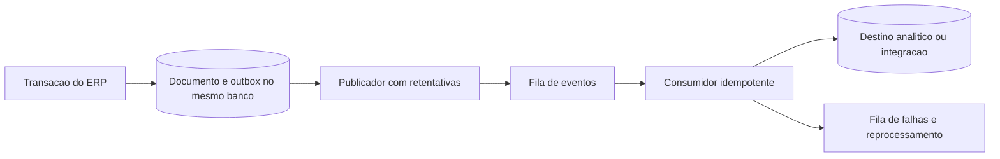

# Sistemas distribuídos

Revisão: 16/09/2026. **Atual: monólito com banco H2 local. Evolução abaixo: proposta, não implantada.**

## O que já envolve comunicação e concorrência

O navegador se comunica por HTTP com a aplicação, mas os módulos Java compartilham processo e banco. Isso não constitui uma arquitetura de microsserviços. Há concorrência de requisições e confirmações, tratada por transações, travas e restrições no banco. [ExpedicaoService](../../src/main/java/com/portfolio/rastreabilidade/expedicao/ExpedicaoService.java) e [teste de concorrência](../../src/test/java/com/portfolio/rastreabilidade/expedicao/ExpedicaoConcorrenciaIntegrationTest.java) são evidências.

A trava do documento serializa alterações do mesmo rascunho. A confirmação de expedição trava produtos em ordem de ID e valida a soma de itens por produto/lote. Uma origem única por item reduz duplicação, mas não existe chave de idempotência HTTP para integrações externas. O comportamento em outro banco precisa de testes próprios.

## Evolução em etapas

| Etapa proposta | Objetivo | Condição para adotar |
|---|---|---|
| Aplicação e banco em servidores separados | Separar responsabilidades de operação e armazenamento | Banco de destino homologado, rede restrita e recuperação validada |
| Mais de uma instância da aplicação | Reduzir indisponibilidade e distribuir requisições | Sessões compartilhadas ou estratégia validada, migrações coordenadas e testes de concorrência |
| Processamento assíncrono | Isolar notificações, exportações ou cargas analíticas | Fila, idempotência, retentativas, acompanhamento e reconciliação |
| Extração de serviços | Escalar ou entregar domínios de forma independente | Gargalo medido, equipe e contratos estáveis que justifiquem o custo |

Não compartilhar o arquivo H2 atual entre máquinas como estratégia de distribuição. Em múltiplas instâncias, preservar a coordenação do estoque no banco; um lock apenas em memória não protege processos distintos.

## Integração futura por eventos

Outbox e fila ainda não existem. A proposta evita confirmar no banco e perder o evento por falha entre banco e rede. O consumidor deverá aceitar entrega repetida sem repetir efeitos; não prometer processamento global exatamente uma vez.

Contrato proposto: `eventId`, tipo, versão, identificador do agregado, sequência/versão do agregado, instante com fuso e `correlationId`. Não incluir senha, hash ou sessão. Ordenação necessária por documento/produto deve ser definida; relógio de parede sozinho não garante ordem de processamento.

## Falhas e consistência

| Falha | Tratamento proposto | Evidência exigida |
|---|---|---|
| Rede interrompida após confirmação | Consultar estado antes de repetir; chave idempotente | Reenvio não duplica movimento |
| Evento duplicado | Registro de evento processado e operação idempotente | Mesmo evento produz um único efeito |
| Evento fora de ordem | Versão do agregado e espera/reconciliação | Estado final consistente |
| Consumidor indisponível | Retentativa limitada, espera crescente e fila de falhas | Retomada sem perda silenciosa |
| Banco indisponível | Falhar sem sucesso aparente; monitorar e recuperar | Nenhuma confirmação parcial |
| Serviço remoto lento | Timeout, isolamento e tratamento explícito de pendência | ERP não fica preso indefinidamente |

A transação atual é local. Fluxos que atravessem bancos precisariam de compensações explícitas, preservando histórico; cancelar logicamente não é apagar movimentos já emitidos. Estoque não deve depender de saldo analítico eventualmente consistente para autorizar saída.

## Critérios de decisão

Medir p95 de latência, saturação, espera por locks, volume e disponibilidade antes de distribuir. Testar sessão, duplicidade, queda parcial, migrações e recuperação. Registrar decisão arquitetural com alternativa, motivo, custo, responsável e evidência. Esta documentação não autoriza instalar infraestrutura ou contratar serviços.
