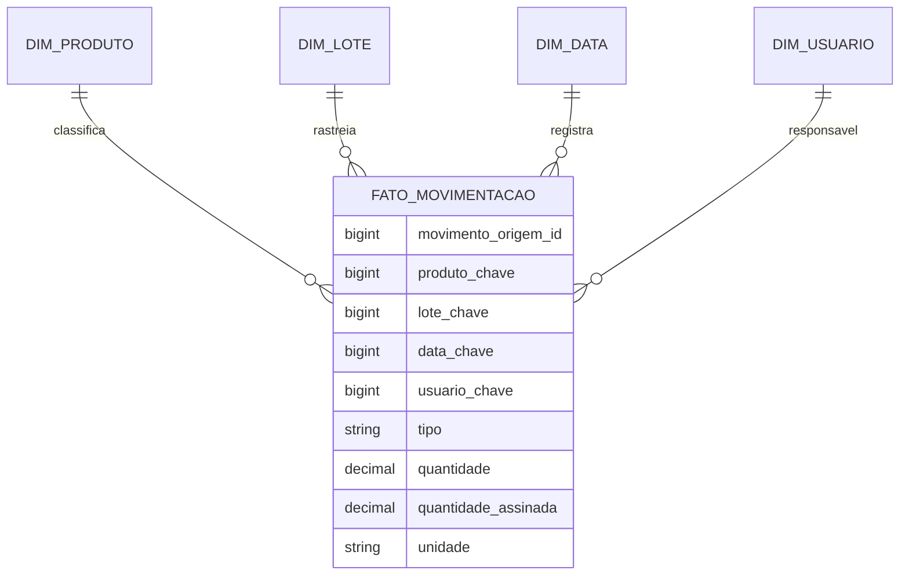

# Data analytics

Revisão 16/09/2026. **Situação: consultas operacionais implementadas; pipeline, modelo dimensional e dashboards analíticos propostos.** Fonte operacional: [MovimentacaoEstoqueRepository](../../src/main/java/com/portfolio/rastreabilidade/estoque/MovimentacaoEstoqueRepository.java) e [RastreabilidadeRepository](../../src/main/java/com/portfolio/rastreabilidade/rastreabilidade/RastreabilidadeRepository.java).

## Perguntas de negócio

Quanto existe fisicamente por produto/lote? Quais saldos estão próximos do vencimento? Qual a origem/destino de um lote? Quanto tempo documentos levam até a confirmação? As duas primeiras bases e o histórico podem ser derivados dos dados atuais; painéis gerenciais ainda precisam ser construídos. Previsão de demanda, rentabilidade, OTIF e inadimplência dependem de dados que não existem integralmente.

## Fontes e granularidade

| Fonte | Grão atual | Uso | Limite |
|---|---|---|---|
| `produto` | Um cadastro de produto | Unidade, tipo, fracionamento e situação | Sem custo, preço, margem ou histórico completo de versões |
| `lote` | Um lote por produto/número | Validade e rastreabilidade | Sem série ou estado de quarentena |
| `recebimento` / `expedicao` | Um documento | Participante, datas, estado e confirmação | Participantes como texto; sem cadastro mestre de fornecedor/cliente |
| Itens dos documentos | Um item | Produto/lote e quantidade documental | Rascunho não representa movimento efetivo |
| `movimentacao_estoque` | Um movimento por item confirmado | Entradas/saídas, quantidade positiva, tipo, instante e responsável | Sem estornos/ajustes implementados |
| `usuario_perfil` / `perfil_permissao` | Um vínculo | Controle de acesso | Não representam histórico de concessões |

## Modelo dimensional proposto



Grão da fato: **uma movimentação operacional**, identificada por seu ID de origem. Dimensões e nomes do diagrama são propostos, não tabelas existentes. Para operações sem lote, usar membro analítico explícito "Sem lote"; não perder linhas por join interno. Fornecedor/destinatário pode ser atributo de documento inicialmente; sua consolidação demanda cadastro mestre, não agrupamento cego de textos parecidos.

Manter quantidade original positiva e medida assinada (entrada positiva, saída negativa). Dimensões versionadas poderão preservar descrições vigentes à época, mas a história anterior à captura não pode ser reconstruída por suposição. Evitar armazenar senha_hash ou tokens em qualquer extração.

## Extração e linhagem propostas

1. Extrair inicialmente em lote, de forma somente leitura, com recorte consistente e janela controlada.
2. Identificar origem, versão do esquema, instante, quantidade de registros e responsável da carga.
3. Validar chaves, tipos, escala, unidade e integridade antes de publicar.
4. Carregar de forma idempotente por ID de origem, mantendo log de rejeições e reprocessamento.
5. Conciliar contagens e somas por tipo/produto/lote; publicar apenas após critérios de qualidade.
6. Exibir watermark e data de atualização nos painéis.

Não usar apenas `id > último_id` como garantia de extração sem perda: IDs podem ser alocados antes de transações que confirmam fora de ordem. Definir snapshot consistente, sobreposição com deduplicação e reconciliação; CDC é opção futura a avaliar. Datas de negócio não substituem o instante de captura.

Linhagem mínima: KPI → medida/filtro → tabela analítica → ID da carga → versão da transformação → tabela/ID operacional. Mudanças em dimensões não devem alterar silenciosamente relatórios históricos já aprovados.

## Exemplo SQL de conciliação do saldo atual

Consulta somente leitura baseada no esquema existente; não cria relatório ou integração automaticamente.

```sql
SELECT
    p.id AS produto_id,
    p.codigo,
    p.unidade_medida,
    m.lote_id,
    SUM(CASE
        WHEN m.tipo = 'ENTRADA' THEN m.quantidade
        WHEN m.tipo = 'SAIDA' THEN -m.quantidade
        ELSE 0
    END) AS saldo_fisico
FROM movimentacao_estoque m
JOIN produto p ON p.id = m.produto_id
GROUP BY p.id, p.codigo, p.unidade_medida, m.lote_id
ORDER BY p.codigo, m.lote_id;
```

Não soma produtos sem movimentos nem calcula reservado/disponível. Não expor essa consulta a usuários sem autorização de quantidade física. Erros de tipo fora de ENTRADA/SAIDA devem ser rejeitados na qualidade, ainda que o esquema atual já os restrinja.

## Qualidade e acesso

| Controle proposto | Critério |
|---|---|
| Completude | Chaves, tipo, quantidade, instante e responsável presentes |
| Unicidade | ID da movimentação de origem sem duplicação |
| Consistência | Produto do lote corresponde ao produto movimentado |
| Validade | Quantidade positiva, precisão suportada e inteiro se não fracionável |
| Conciliação | Totais e contagens da carga correspondem ao recorte operacional |
| Atualidade | Atraso explicitado; meta acordada antes de alertar |
| Autorização | Restrições de dado aplicadas no servidor de relatórios e exportações |

Agregações também podem revelar saldos/custos. Filtros da interface não bastam: restringir fonte, consulta, exportação e cache conforme o usuário. Dados de usuários são minimizados; retenção e acesso devem ser aprovados pelos responsáveis.

## Entrega inicial proposta

Começar por saldo/validade e tempo de confirmação, sem ferramenta externa obrigatória. Aprovar definições no [catálogo de indicadores](../gestao/03-indicadores-desempenho.md), medir custo das consultas e separar carga analítica caso prejudique o ERP. Critério de aceite: conciliação reproduzível, acesso negativo testado, carga repetida sem duplicidade, retomada após falha e atualização visível.
