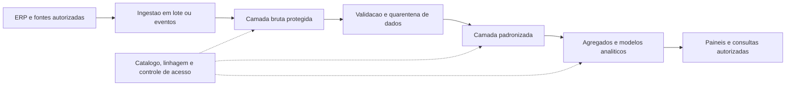

# Big data — estratégia de evolução

Revisão 16/09/2026. **Não há big data implementado ou necessidade de escala comprovada.** O ERP atual usa banco relacional local; volume, taxa de ingestão e retenção não foram medidos. Data analytics pode começar nesse contexto sem plataforma distribuída.

## Quando reavaliar

| Dimensão | Evidência a coletar | Pergunta de decisão |
|---|---|---|
| Volume | Registros/dia, bytes/registro, crescimento e retenção | A capacidade e o prazo de consulta deixam de atender mesmo após otimização? |
| Velocidade | Eventos/s, picos e latência necessária | Lote periódico atende ou é necessário fluxo contínuo? |
| Variedade | Tabelas, documentos, logs, dados de transporte/sensores futuros | Há dados que exigem outros formatos de armazenamento/processamento? |
| Veracidade | Duplicidade, atraso, ausência e inconsistência | Existe controle para confiar no resultado? |
| Valor | Decisão beneficiada, custo evitado e esforço operacional | O benefício justifica tecnologia e equipe adicionais? |

Definir limiares a partir de medições, não de números arbitrários de registros. O crescimento do ERP não implica migração automática para microsserviços ou big data.

## Arquitetura conceitual futura

Camada bruta preserva a entrada autorizada para rastrear/reprocessar, sem copiar segredos. Padronização trata esquemas, unidade, tempo e duplicidade. Camada analítica atende contratos de indicadores. "Quarentena de dados" é isolamento técnico de registros inválidos; não equivale à quarentena física de produtos.

Não foram escolhidos produtos comerciais, cluster, broker ou armazenamento. Primeiro decidir requisitos; depois comparar custo, portabilidade, suporte, operação, segurança e saída do fornecedor.

## Processamento e consistência

- Ingestão repetida deve ser idempotente; versão de esquema acompanha cada conjunto/evento.
- Preservar instante do evento e instante de processamento para tratar atraso e eventos fora de ordem.
- Watermarks, janelas e política de correção devem ser explícitos; chegada tardia pode exigir republicação identificada de indicador.
- Particionamento por tempo/origem deve ser avaliado com distribuição real, evitando partições desbalanceadas.
- Reprocessamento deve ser rastreável e conciliado com a origem.
- Consulta analítica pode ser eventualmente consistente. Autorização de saída de estoque continua dependendo da transação operacional, não de um painel atrasado.

## Governança, custo e acesso

Catalogar proprietário, classificação, finalidade, retenção, origem e consumidores de cada conjunto. Definir menor privilégio por camada, criptografia e gestão de chaves, isolamento de ambientes, trilha de acesso e descarte controlado. Não tornar dados acessíveis apenas porque foram copiados para um lake.

Modelo de custo proposto: armazenamento por camada/retenção + processamento + ingestão + transferência + backup + observabilidade + suporte/equipe. Comparar custo por carga e por relatório útil. Não há orçamento ou preço contratado nesta revisão.

## Plano de adoção condicional

1. Medir fontes e implementar analytics relacional com conciliação.
2. Registrar gargalo real e alternativas menos complexas.
3. Fazer prova de conceito com dados sintéticos/anonimizados e critérios mensuráveis.
4. Ensaiar duplicidade, falha, atraso, recuperação, acesso indevido e exportação de saída.
5. Aprovar custo e capacidade operacional antes de produção.

Sucesso não é possuir uma plataforma: é entregar uma decisão confiável no prazo e custo aprovados. [Sistemas distribuídos](../arquitetura/03-sistemas-distribuidos.md) detalha falhas e contratos; [analytics](01-data-analytics.md) define grão e linhagem.
