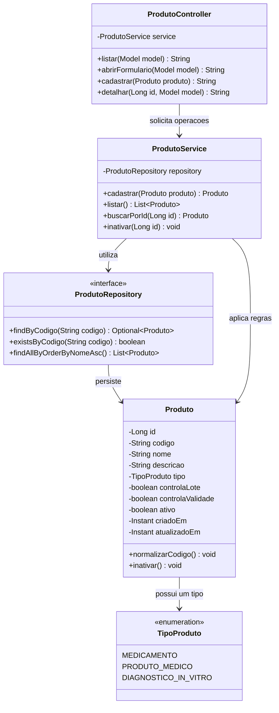
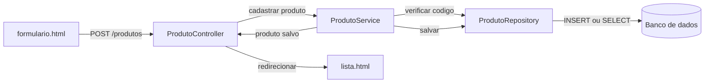
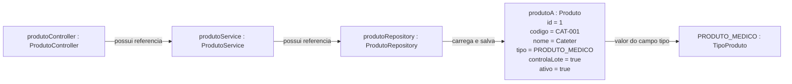

# Diagramas — Módulo de Produtos

## 1. Organização das pastas

```text
src/main/java/br/com/japrodutos/sistema/
└── produto/
    ├── TipoProduto.java
    ├── Produto.java
    ├── ProdutoRepository.java
    ├── ProdutoService.java
    └── ProdutoController.java

src/main/resources/
├── db/migration/
│   └── V2__criar_tabela_produto.sql
└── templates/produtos/
    ├── lista.html
    ├── formulario.html
    └── detalhe.html

src/test/java/br/com/japrodutos/sistema/
└── produto/
    ├── ProdutoServiceTest.java
    └── ProdutoControllerTest.java
```

## 2. Diagrama de classes



As operações mostradas são uma referência de organização, não uma obrigação de copiar todos os métodos imediatamente.

## 3. Como uma requisição percorre o sistema



## 4. Diagrama de objetos

O diagrama de classes mostra os moldes. O diagrama de objetos mostra exemplos que existem durante a execução.



## 5. Diferença entre classe e objeto

```text
Classe  = molde ou definição: Produto.java
Objeto  = um exemplar criado a partir do molde: produtoA
Campo   = característica do objeto: nome
Método  = comportamento do objeto: inativar()
```

Exemplo conceitual:

```java
Produto produtoA = new Produto();
```

`Produto` é a classe. `produtoA` é a variável que referencia um objeto dessa classe. `new Produto()` cria o objeto.
