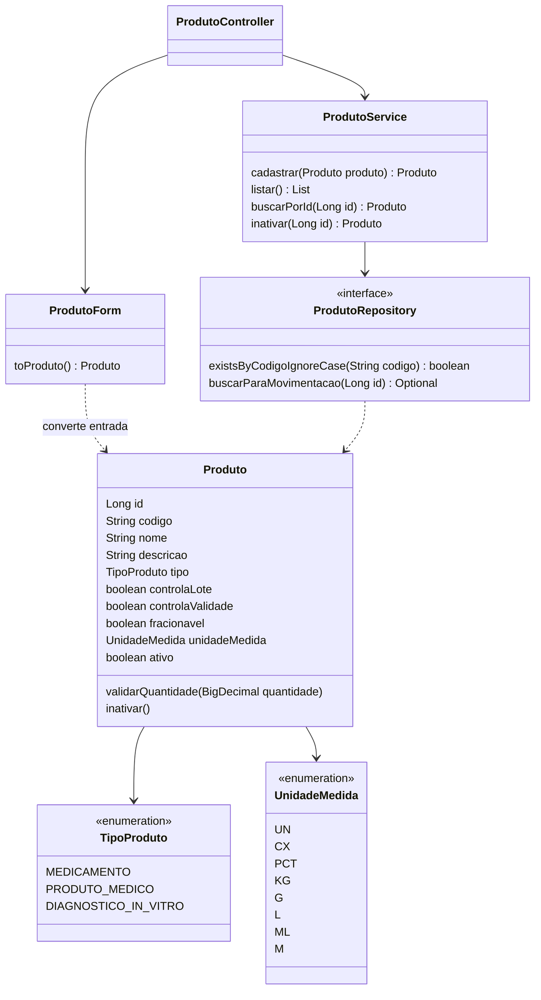
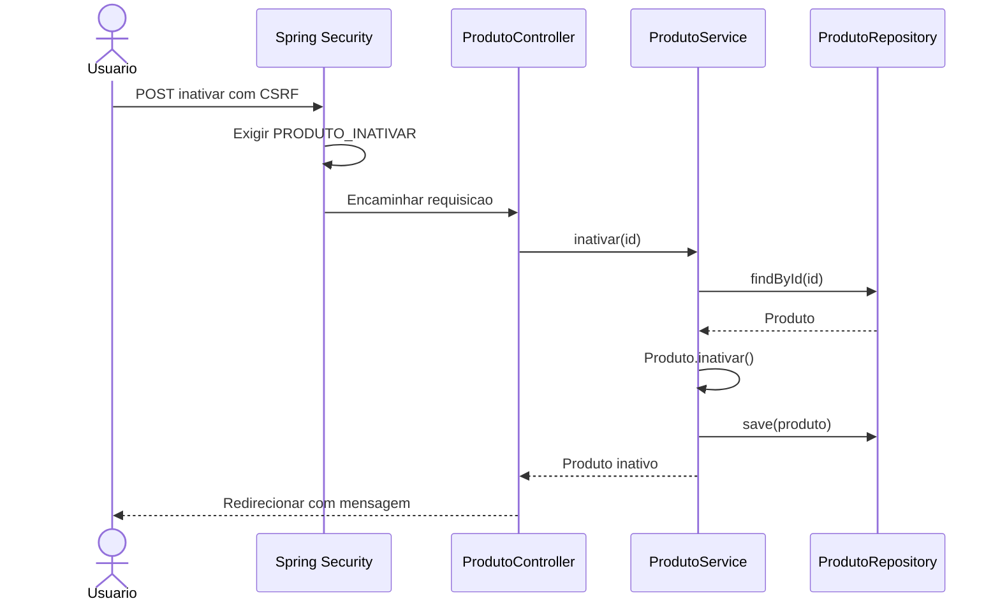

# Diagramas — Produtos

Revisão 16/09/2026. Complementa o [UML do ERP](../arquitetura/02-uml.md).

`ProdutoRepository` herda operações de `JpaRepository`; a consulta `buscarParaMovimentacao` aplica trava pessimista na confirmação de expedição. A listagem de campos é simplificada, não uma cópia completa das assinaturas.

Produto inativo continua referenciado pelo histórico. Esconder um botão não substitui a regra de rota. O produto não possui `criadoEm`/`atualizadoEm` implementados nesta versão.
