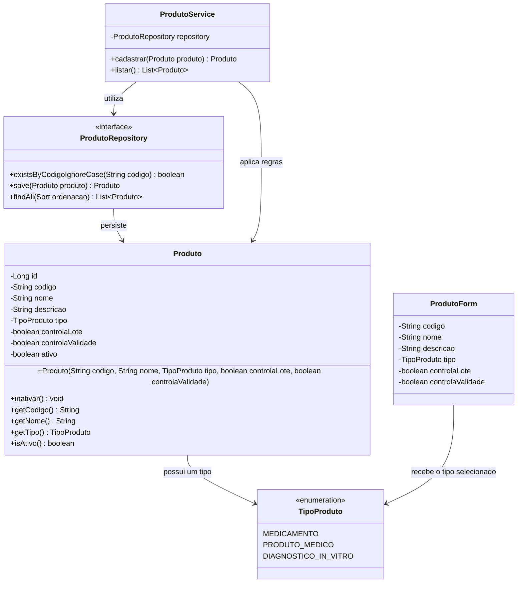
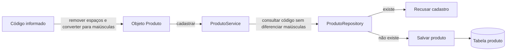
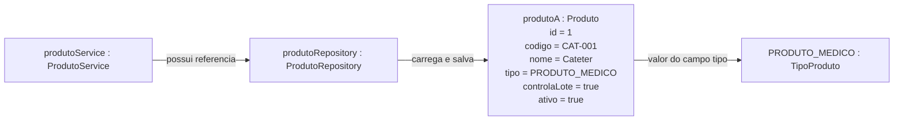

# Diagramas — Módulo de Produtos

## 1. Organização das pastas

### Arquivos existentes

```text
src/main/java/br/com/japrodutos/sistema/
└── produto/
    ├── TipoProduto.java
    ├── Produto.java
    ├── ProdutoRepository.java
    ├── ProdutoService.java
    └── ProdutoForm.java

src/main/resources/
└── db/migration/
    └── V2__criar_tabela_produto.sql

src/test/java/br/com/japrodutos/sistema/
└── produto/
    ├── ProdutoTest.java
    └── ProdutoServiceTest.java
```

### Arquivos planejados para concluir o módulo

```text
src/main/java/br/com/japrodutos/sistema/produto/
└── ProdutoController.java

src/main/resources/templates/produtos/
├── lista.html
├── formulario.html
└── detalhe.html

src/test/java/br/com/japrodutos/sistema/produto/
└── ProdutoControllerTest.java
```

## 2. Diagrama de classes



Este diagrama mostra somente o que já existe. `save` e `findAll` são herdados de `JpaRepository`; não precisam ser escritos novamente na interface.

Durante a construção de `Produto`, o código recebido é normalizado com `trim()` e `toUpperCase(Locale.ROOT)` antes de ser armazenado no campo `codigo`.

## 3. Fluxo implementado no serviço



O fluxo pelo navegador será acrescentado quando `ProdutoController` e as telas forem implementados.

## 4. Diagrama de objetos

O diagrama de classes mostra os moldes. O diagrama de objetos mostra exemplos que existem durante a execução.



## 5. Diferença entre classe e objeto

```text
Classe  = molde ou definição: Produto.java
Objeto  = um exemplar criado a partir do molde: produtoA
Campo   = característica do objeto: nome
Método  = comportamento do objeto: inativar()
```

Exemplo conceitual:

```java
Produto produtoA = new Produto(
        "CAT-001",
        "Cateter",
        TipoProduto.PRODUTO_MEDICO,
        true,
        true
);
```

`Produto` é a classe. `produtoA` é a variável que referencia um objeto dessa classe. `new Produto(...)` chama o construtor e cria o objeto.
